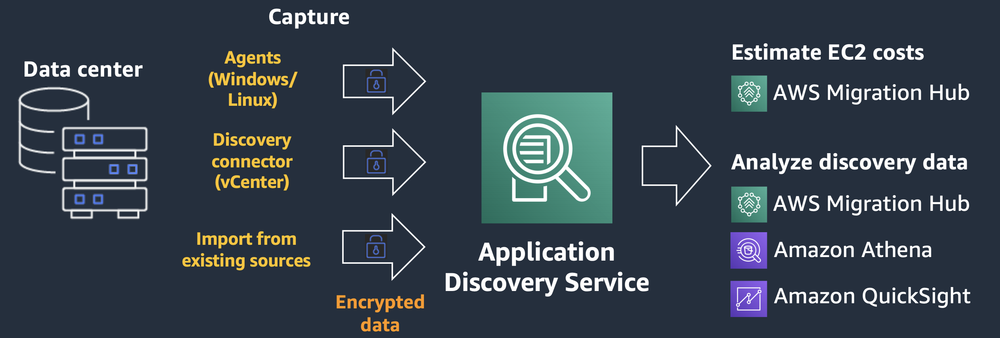
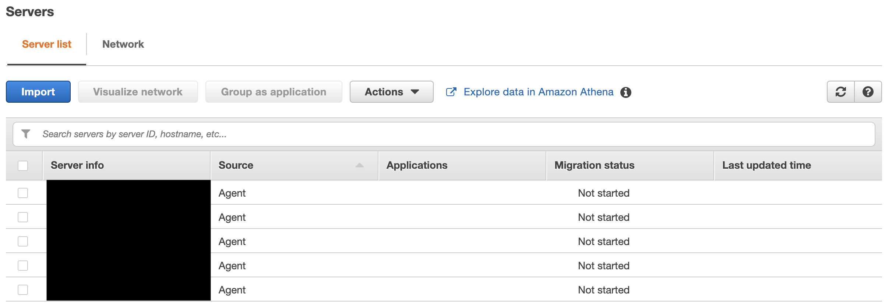

## AWS Application Discovery Service

**Introduction**

- AWS Discovery Agent is an AWS software that is deployed in any targeted servers like physical on-premises servers, Amazon EC2 instances, and virtual machines for discovery and migration. It captures information like system configuration, system performance, running processes, and details of the network connections between systems.

- This agent required root privileges to collect the information. When you start the Discovery Agent, it registers with the Application Discovery Service endpoint, arsenal.aws.com, and pings the service at 15-minute intervals for configuration information

- To initiate the agent to capture data collection we need to send a command. All the information captured helps to visualize all the IT assets and their dependencies, calculate the total cost of ownership, and also the migration plan.

- Data captured is transferred securely using Transport Layer Security (TLS) encryption. Agents are configured to upgrade automatically when new versions become available. You can change this configuration setting if desired.

  

**Tutorial**

- On this section we will start utilizing AWS Application discovery services, by:

  - Create AWS Credentials  
  
  - Installing ADS agents in the servers
  
  - Starting ADS data collection
  
  - Browsing the discovered data
  
  - Explore EC2 instance recommendations
  
  - Enabling ADS and Athena integration

- Create AWS Credentials 

  1. Traverse to the <a href="https://console.aws.amazon.com/iamv2/">Amazon IAM console</a>  
  
  2. In the IAM screen, click on Users and Select Add users button on the right side of the screen
  
      

  
  3. Provide Username ADSAgent and select Programmatic access under Access type
      
      

  
  4. Click Next to add required permission. Under permission screen, choose Attach existing policies directly and select AdministratorAccess under Poilcy Name
  
      

  
  5. Click Next, and provide required tags
  
  6. Click Next, and review all the provided details. Finally click Create user
  
      

  
  7. Now the user is created, download the csv file which contains Access & Secret Key required while deployed AWS Discovery Agent
  
      

- Installing ADS agents in the servers

  1. Download and install the agents as per the following instructions
  
      - For Lunix Machine 
  
      ``curl -o ./aws-discovery-agent.tar.gz https://s3-us-west-2.amazonaws.com/aws-discovery-agent.<supported-aws-region>/linux/latest/aws-discovery-agent.tar.gz``
        
      ``tar -xzf aws-discovery-agent.tar.gz``
        
      ``sudo bash install -r "us-west-2" -k "<AWS key id>" -s "<AWS key secret>" ``
       
      - For Windows Machine  
    
      ``Import-Module BitsTransfer``

       ``Start-BitsTransfer -Source "https://s3-us-west-2.amazonaws.com/aws-discovery-agent.<supported-aws-region>/windows/latest/AWSDiscoveryAgentInstaller.msi" -Destination "    C:\Users\Administrator\Downloads\" ``

       ``msiexec.exe /i c:\Users\Administrator\Downloads\AWSDiscoveryAgentInstaller.msi REGION="<supported-aws-region>" KEY_ID="<aws key id>" KEY_SECRET="<aws key secret>" /q ``
     
       **Note:**

        -  Update < AWS key id > and < AWS key secret > with the information downloaded during the ADSAgent user creation step

        -  Update < supported-aws-region > with AWS region you are performing this tutorial from the list of AWS regions where AWS Application Discovery Service is available 
      
       

      
   2.  Follow the above commands for all the different Linux and Windows instances you are planning to perform the discovery.

- Starting ADS data collection

  1. Traverse to the <a href="https://us-west-2.console.aws.amazon.com/migrationhub/">AWS Migration Hub</a>
  
  2. Under Migration Hub navigation pane, click Data Collectors under Discover section.
  
  3. Choose a Migration Hub home region from the drop-down list, it should be the same what we provided while running discovery agents
  
  4. Switch to Agents tab, to view all the servers where Discovery Agent is running. Please verify all servers are available before we proceed 
    
      

  
  5. Choose all the check box of the agent you want to start discovery, then Click on Start data collection
  
      

      
      

   
  6. We can also enable Athena integration to visualize the discovery data and perform create a Quicksight dashboard if required 
      
      

 

- Browsing the discovered data

  1. Traverse to the <a href="https://us-west-2.console.aws.amazon.com/migrationhub/">AWS Migration Hub</a>
  
  2. Under Migration Hub navigation pane, click Server under Discover section
  
     

 
  
  3. To retrieve more detail such as OS, Memory, CPU, Performance Information, etc, click on server FQDN
      
      

 

- Explore EC2 instance recommendations

  1. Traverse to the <a href="https://us-west-2.console.aws.amazon.com/migrationhub/">AWS Migration Hub</a>
  
  2. Under Migration Hub navigation pane, click Assess under EC2 Instance Recommendations

- Enabling ADS and Athena integration
